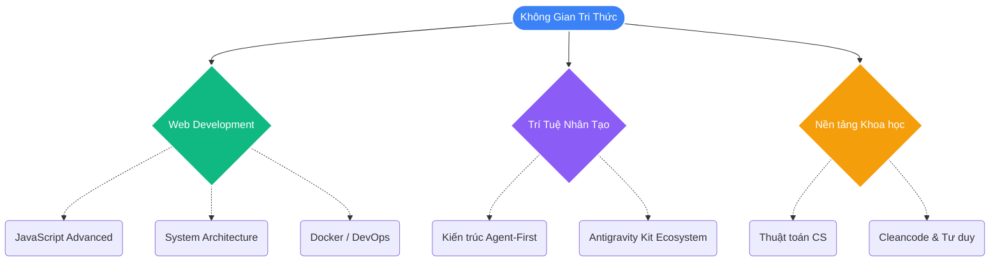

# 🚀 Chào mừng đến với Digital Garden của QuanBM

!!! abstract "Đôi nét về nơi này"
    **Xin chào!** Chào mừng bạn đến với trang web cá nhân của mình. 
    Đây là một cuốn sổ tay kỹ thuật số (Digital Garden) — nơi mình dùng để liên tục ghi chép, lưu trữ và phản tư lại những kiến thức, trải nghiệm, và bài học đúc kết được trong quá trình học tập và làm việc.   
    Nơi đây bao gồm sự pha trộn của nhiều chủ đề đa dạng, nhưng **tập trung cốt lõi nhất vào Web Development và Trí Tuệ Nhân Tạo (AI)**.

---

## 🌟 Hành Trình Khám Phá Kiến Thức

Thay vì để kiến thức trôi dạt trong các tệp note lộn xộn trên máy tính, trang web này ra đời để hệ thống hóa chúng một cách mạch lạc, đồng thời thân thiện chia sẻ nó với cộng đồng và những người có cùng đam mê.

### 💻 Web Development
Lập trình không chỉ là gõ mã, đó là nghệ thuật sắp xếp logic, xử lý hệ thống bất đồng bộ và kiến trúc tính năng bền vững.
 
- 🟨 **[JavaScript & Frontend](posts/javascript/index.md):** Khám phá "Under the Hood" của JS (Call Stack, Event Loop, Bộ nhớ), làm chủ Async (RxJS, NgRx), và thực hành Clean code.
- 🛡️ **[Kiến Trúc & Bảo mật (ABAC)](posts/abac/plan.md):** Lộ trình tìm hiểu chuyên sâu về các mô hình kiểm soát truy cập (ABAC, RBAC, DAC, MAC, NGAC).
- 🐳 **[Hạ tầng Deployment](posts/Docker/summary.md):** Đơn giản hoá vận hành với Docker, tích hợp thông điệp bằng [Kafka](posts/Kafka/compare.md).
- 🧮 **[Thuật toán Hệ thống](posts/alth/quicksort.md):** Rèn luyện tư duy máy tính thông qua các thuật toán cốt lõi.

### 🤖 Trí Tuệ Nhân Tạo (AI)
Đón đầu kỷ nguyên AI thông minh, biến Hệ thống ngôn ngữ lớn (LLMs) thành những chuyên gia ảo đồng hành.

- 🌌 **[Antigravity Kit (Agent-First)](posts/antigravity/summary.md):** 
Khám phá hệ sinh thái lập trình được thiết kế chuyên sâu cho AI. Tìm hiểu cách các Agent (Tác tử), Skills (Kỹ năng) và Workflows được điều phối để tự động hóa hàng loạt quy trình phức tạp, tận dụng khả năng suy luận của siêu mô hình Gemini 3 Pro.

---

## 🗺️ Bản Đồ Sự Nghiệp & Tri Thức

---

## ⚡ Điều Hướng Nhanh

!!! tip "Truy cập nhanh chóng"
    Bạn có thể dùng thanh điều hướng bên trái, hoặc nhấn thử một trong các chuyên đề dưới đây để đọc bài ngay:

| 🔖 Lĩnh Vực | 📝 Nội Dung Trọng Tâm | 🔗 Đường Dẫn |
| :------- | :-------- | :------ |
| **JS Mastery** | Hiểu sâu V8 Engine, DOM, Async RxJS | [Bắt đầu học 🚀](posts/javascript/index.md) |
| **AI Agentic** | Khám phá Kiến trúc đa tác tử, Prompt Skills | [Vào hệ sinh thái 🚀](posts/antigravity/summary.md) |
| **Architecture**| Phân quyền với Attribute-Based Access Control | [Tìm hiểu 🚀](posts/abac/plan.md) |

---

 

  <i>"Học tập là một cuộc hành trình không có điểm dừng. Việc viết ra chính là cách học lại một lần nữa."</i>

