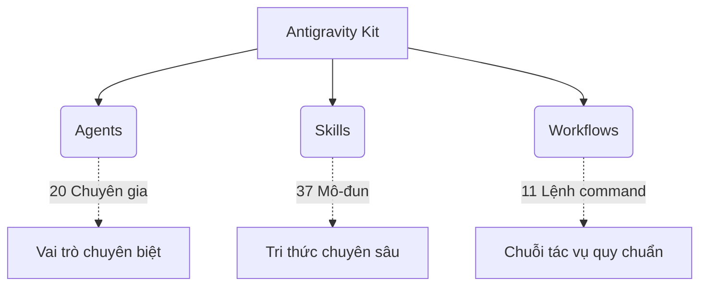

# 🌌 Tổng Quan: Hệ Sinh Thái Lập Trình Dựa Trên Tác Tử (Agent-First)

!!! abstract "Tóm tắt cốt lõi"
    Trước khi đi sâu vào các quy trình sư phạm và kỹ thuật cốt lõi, việc thấu hiểu tường tận **Antigravity Kit** là điều kiện tiên quyết. Nền tảng Google Antigravity không đơn thuần là một trình soạn thảo mã (IDE) được tích hợp công cụ trò chuyện; nó là một sự **tái định nghĩa lại khái niệm về môi trường phát triển tích hợp (IDE)**, được thiết kế riêng cho kỷ nguyên mà trí tuệ nhân tạo (AI) có khả năng suy luận dài hạn.

---

## 🚀 1. Kỷ Nguyên Agent-First Và Triết Lý Của Google Antigravity

Các công cụ hỗ trợ lập trình thế hệ trước thường rơi vào hai thái cực: 

1. 🕵️‍♂️ Yêu cầu người dùng (lập trình viên) giám sát và điều chỉnh từng thao tác nhỏ bé.
2. 📦 Hoạt động như một "hộp đen", đưa ra kết quả nhưng che tự che giấu mọi tiến trình suy luận logic.

**Google Antigravity** phá vỡ vách ngăn này bằng cách thiết lập bốn nguyên lý cốt lõi: 

- 🤝 **Niềm tin (Trust)**
- 🤖 **Tự trị (Autonomy)**
- 🔄 **Phản hồi (Feedback)** 
- 📈 **Tự cải thiện (Self-improvement)**

Ra mắt dưới dạng bản xem trước công khai vào tháng 11 năm 2025, nền tảng này sử dụng mô hình **Gemini 3 Pro** - được tối ưu hóa đặc biệt cho khả năng suy luận mã nguồn, xử lý các khung ngữ cảnh khổng lồ và lập kế hoạch đa bước tinh vi.

!!! tip "💡 Điểm Khác Biệt Cốt Lõi"
    Không giống như các hệ thống chỉ đơn thuần "tự động hoàn thành dòng mã" (autocomplete), Antigravity cung cấp một hệ thống **Kiểm soát sứ mệnh (Mission Control)** thông qua thành phần Agent Manager. Nó cho phép quản lý các tác tử bất đồng bộ (asynchronous agents) hoạt động song song trên nhiều không gian làm việc. 
    
    Hơn thế nữa, tính năng Broker Agent còn trao cho AI quyền điều khiển **trình duyệt không đầu (headless browser)** để tự chủ kiểm thử giao diện người dùng, đọc bảng điều khiển động, tương tác với các hệ thống quản lý mã nguồn (SCM) và xác minh tính toàn vẹn của ứng dụng từ đầu đến cuối (E2E) một cách độc lập.

---

## 🧬 2. Giải Phẫu Kiến Trúc Lõi Của Antigravity Kit

Nếu Google Antigravity là *"phần cứng và hệ điều hành"*, thì **Antigravity Kit** chính là *"Hệ cơ sở dữ liệu tri thức và Nguyên tắc ứng xử"* dành cho các tác tử. Dự án mã nguồn mở này đóng gói một bộ khung thiết lập sẵn nhằm chuẩn hóa hành vi của AI, loại bỏ tình trạng suy giảm ngữ cảnh (context bloat) và giảm thiểu rủi ro tiêu tốn token không kiểm soát.

Khi bạn cài đặt bộ công cụ này vào hệ thống thông qua giao diện dòng lệnh (ví dụ: `npx @vudovn/ag-kit init`), một thư mục cốt lõi `.agent/` sẽ được nội suy vào dự án. Cấu trúc này được phân rã thành ba trụ cột chính:

| Trụ Cột Kiến Trúc | Số Lượng Cấu Phần | Vai Trò Và Cơ Chế Hoạt Động Cốt Lõi |
| :--- | :--- | :--- |
| 🎭 **Hệ Thống Tác Tử (Agents)** | 20 Chuyên gia | Các tệp định nghĩa đóng vai trò như nhân cách chuyên gia. Khi kích hoạt, AI từ bỏ góc nhìn chung chung để nhập vai vào chuyên gia bảo mật, kiến trúc sư, v.v., tuân thủ nghiêm ngặt nguyên tắc. |
| 🛠️ **Mô-đun Kỹ Năng (Skills)** | 37 Mô-đun | Các tệp `SKILL.md` chứa tri thức chuyên sâu. Kỹ năng là cầu nối giữa năng lực của AI và bối cảnh dự án, quy ước định dạng mã, thiết kế UX/UI. |
| 🛤️ **Quy Trình Chuẩn (Workflows)**| 11 Lệnh điều khiển| Kích hoạt qua `/slash-command` như `/brainstorm`, `/create`, `/orchestrate`. Định tuyến AI vào các chuỗi tác vụ có hệ thống. |

!!! info "Bản chất của thiết kế"
    Sự phân tách logic thành **Agents**, **Skills**, và **Workflows** giải quyết bài toán nan giải trong *Prompt Engineering*. Thay vì nhồi nhét mọi quy tắc vào một tệp hướng dẫn khổng lồ làm mô hình "quá tải", Antigravity Kit chỉ nạp cục bộ các kỹ năng tương ứng ở thời điểm chạy (runtime), từ đó tối ưu nguồn tài nguyên token.

---

## 🎯 3. Trí Tuệ Định Tuyến Và Giao Thức Phòng Vệ

Sức mạnh thực sự của Antigravity Kit không chỉ nằm ở các kho kỹ năng tĩnh, mà còn ở cơ chế suy luận động và điều phối luồng quy trình (đặc tả qua `AGENT_FLOW.md` và `intelligent-routing-guide.md`).

### 🏛️ 3.1. Giao Thức Cổng Socrates (Socratic Gate Protocol)

Được thiết kế như một **chốt chặn nhận thức**, giao thức này mô phỏng cách một kỹ sư phần mềm kỳ cựu xử lý yêu cầu:

- 🆕 **Phát triển tính năng mới:** Đặt ra ít nhất 3 câu hỏi chiến lược xác định giới hạn, ranh giới (Edge cases).
- 🐛 **Sửa lỗi (Bug Fix):** Xác nhận nguyên nhân gốc rễ và đánh giá "tác động lan truyền" tiềm ẩn của bản vá.
- ❓ **Yêu cầu mơ hồ (Vague Request):** Yêu cầu cung cấp rõ ba yếu tố: Trọng tâm (Purpose), Trải nghiệm người dùng (Users), và Phạm vi xử lý (Scope).

!!! warning "🛑 Mục Đích Cốt Lõi"
    Giao thức này giúp triệt tiêu hiện tượng **"Ảo giác hệ thống" (Hallucination)** do AI tự suy đoán thiết kế thiếu căn cứ.

### 🔀 3.2. Ma Trận Định Tuyến Thông Minh (Intelligent Agent Routing Matrix)

Hệ thống tự động phân tích ý định để triệu hồi các chuyên gia AI phù hợp mà không cần lệnh gọi thủ công.

| Phân Loại Nhu Cầu | Từ Khóa Nhận Diện | Chuyên Gia (Agents) | Kỹ Năng (Skills) |
| :--- | :--- | :--- | :--- |
| 🔐 **Xác thực & Bảo mật** | `login`, `auth`, `security` | `@security-auditor` `@backend-specialist` | `vulnerability-scanner` `api-patterns` |
| 🎨 **Cấu trúc Giao diện UI**| `button`, `component`, `layout` | `@frontend-specialist` | `react-best-practices` `tailwind-patterns` |
| ⚡ **Tối ưu Hiệu năng** | `slow`, `optimize`, `performance`| `@performance-optimizer` | `performance-profiling` |
| 🗄️ **Quản trị Cơ sở dữ liệu**| `schema`, `migration`, `query` | `@database-architect` | `database-design` `prisma-expert` |
| ⚙️ **Điều phối Tổng thể** | `build app`, `complex feature` | `@orchestrator` | `parallel-agents` `behavioral-modes` |

> **Lưu ý:** Điều phối đa nhiệm sẽ trực tiếp gọi `@orchestrator` nhằm phân rã công việc cho các tác tử chuyên biệt, quản lý đồng bộ cho đến khi hoàn thiện thuật toán.

---

## 🛡️ 4. Lớp Thẩm Định Chất Lượng Đa Tầng (Validation Layer)

Output của mô hình AI không được triển khai ngay lập tức. Chúng bị kiểm soát thông qua hai Scripts Python nội bộ:

### 🔎 Bước 1: Kiểm Tra Nhanh (`checklist.py`)
- Phân tích mã tĩnh chuyên biệt (Linting).
- Xác thực an toàn và kiểm toán dữ liệu (Type-check).
- Xác thực cấu trúc định dạng đối tượng (Schema Validation).
- Thẩm định chuẩn trải nghiệm trên di động và SEO.

### 🔬 Bước 2: Kiểm Tra Toàn Diện (`verify_all.py`)
- Đo lường chi tiết điểm hiệu năng qua Lighthouse.
- Chạy kịch bản kiểm thử End-to-End đầy đủ giả lập qua hộp đen Playwright.
- Đo đạc kích thước tệp tĩnh để tối ưu hóa Asset Bundling.
- Kiểm duyệt các tiêu chuẩn quốc tế hóa (i18n).

!!! success "🛡️ Kết Luận Tựu Trung"
    Với nền móng này, Antigravity Kit biến môi trường viết mã cục bộ của bạn thành một dây chuyền Tích hợp liên tục (CI) thu nhỏ, nơi mô hình AI đa nền tảng đóng 2 vai diễn: **"Kiến trúc sư"** đồng thời là **"Chuyên gia QA/QC"** đánh giá gắt gao từng tính năng.
