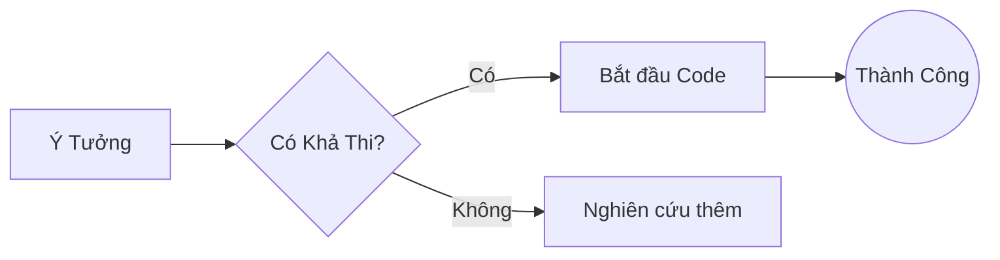
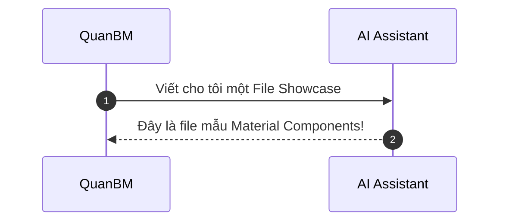
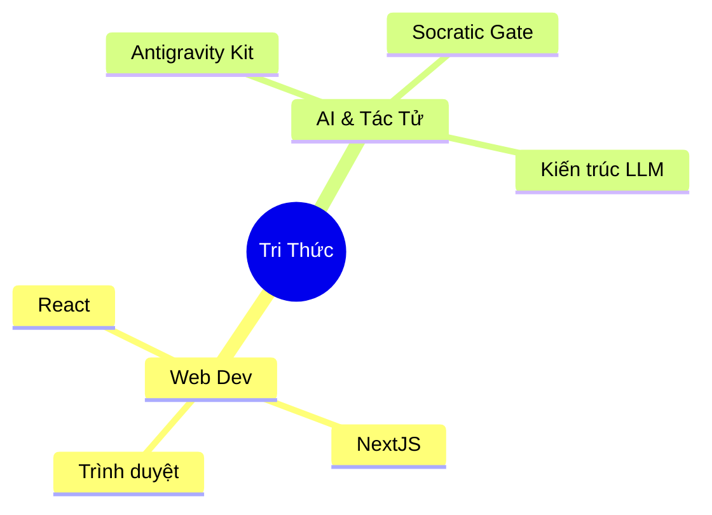

# 🎨 Material Components Showcase

Chào mừng đến với thư viện **Material Components**. File này đóng vai trò như một **Style Guide** (Khuôn mẫu thiết kế), cung cấp cho bạn tất cả các khối nội dung (components) hiện có thể sử dụng trực tiếp bằng Markdown, nhờ vào sức mạnh của Material for MkDocs và các phần mở rộng (Extensions) đã được cấu hình.

---

## 1. 🌈 Các Khối Thông Báo (Admonitions)

Admonitions giúp làm nổi bật các đoạn văn bản quan trọng. Có tổng cộng **12 loại** được hỗ trợ mặc định, mỗi loại có một màu sắc và biểu tượng riêng.

### Các loại cơ bản (Standard Admonitions)

<!-- prettier-ignore-start -->
!!! note "Note (Ghi chú)"
    Đây là khối ghi chú trung lập, thường dùng để bổ sung thông tin nền cho nội dung chính.

!!! abstract "Abstract (Tóm tắt)"
    Tuyệt vời để viết mở bài hoặc tổng quan (overview) trước khi bắt đầu một bài viết dài.

!!! info "Info (Thông tin)"
    Cung cấp thông tin bổ sung, chi tiết hơn.

!!! tip "Tip (Mẹo vặt)"
    Chia sẻ một thủ thuật, cách làm nhanh hoặc mẹo hay.

!!! success "Success (Thành công)"
    Báo hiệu một tác vụ đã hoàn thành hoặc một kết quả tốt.

!!! question "Question (Câu hỏi)"
    Dùng để đặt câu hỏi gợi mở hoặc Q&A.

!!! warning "Warning (Cảnh báo)"
    Cảnh báo người đọc về những vấn đề có thể xảy ra.

!!! failure "Failure (Thất bại)"
    Hiển thị thông báo về một thất bại và cách khắc phục.

!!! danger "Danger (Nguy hiểm)"
    Dành cho các cảnh báo quan trọng nhất, như xóa dữ liệu hoặc gây lỗi hệ thống.

!!! bug "Bug (Lỗi phần mềm)"
    Đánh dấu những chỗ đang có lỗi cần lưu ý.

!!! example "Example (Ví dụ)"
    Trình bày một ví dụ minh họa bằng code hoặc mô tả.

!!! quote "Quote (Trích dẫn)"
    > "Thiết kế không chỉ là trông giống hay cảm giác thế nào. Thiết kế là cách nó hoạt động."
    > 
    > — Steve Jobs
<!-- prettier-ignore-end -->

---

## 2. 🗂️ Khối Có Thể Gập Lại (Collapsible Blocks)

Nhờ extension `pymdownx.details`, bạn có thể tạo các khối có thể mở ra / gập lại.

### Đóng mặc định (Closed by default)

<!-- prettier-ignore-start -->
??? note "Nhấn vào đây để xem chi tiết"
    Nội dung này mặc định được đóng lại để tiết kiệm không gian. Nó đặc biệt hữu ích cho các đoạn code dài, log file, hoặc hướng dẫn bổ trợ không bắt buộc.
<!-- prettier-ignore-end -->

### Mở mặc định (Open by default)

<!-- prettier-ignore-start -->
???+ tip "Gợi ý luôn mở"
    Sử dụng dấu `+` sau `???` để khối này tự động mở sẵn khi tải trang.
<!-- prettier-ignore-end -->

---

## 3. 🖱️ Nút Bấm (Buttons)

Nhờ vào extension `attr_list`, chúng ta có thể biến một link bình thường thành các nút bấm đẹp mắt.

[Nút Mặc Định](#){: .md-button }
[Nút Nổi Bật (Primary)](#){: .md-button .md-button--primary }

---

## 4. 📊 Bảng Biểu (Tables)

Cấu trúc bảng dễ nhìn, tự động đáp ứng (responsive) với các màn hình nhỏ.

| Thành phần |    Loại    | Cú pháp Markdown | Mô tả                         |
| :--------- | :--------: | :--------------- | :---------------------------- |
| **Note**   | Admonition | `!!! note`       | Ghi chú chung, màu xanh dương |
| **Danger** | Admonition | `!!! danger`     | Cảnh báo rủi ro, màu đỏ       |
| **Tip**    | Admonition | `!!! tip`        | Mẹo vặt, màu xanh lá cây      |

---

## 5. 💻 Trình Bày Mã Nguồn (Code Blocks)

Bạn có thể dễ dàng trình bày code với cú pháp highlight, kèm theo tiêu đề của file.

```javascript title="app.js"
function greet(name) {
  // Trả về lời chào
  return `Hello, ${name}! Chào mừng đến với Digital Garden.`;
}

console.log(greet("QuanBM"));
```

Và cả code nhúng `inline code` bằng dấu backtick thông thường.

---

## 6. 🧠 Sơ Đồ Khái Niệm Mở Rộng (Mermaid)

Với `pymdownx.superfences`, bạn có thể vẽ mọi loại sơ đồ UML, Mindmap, Flowchart ngay trong Markdown bằng công cụ **Mermaid**.

### Flowchart (Sơ đồ luồng)



### Sequence Diagram (Sơ đồ tuần tự)



### Sơ đồ tư duy (Mindmap)



---

## 7. 🔠 Định dạng văn bản khác

- **In đậm:** **QuanBM**
- _In nghiêng:_ _Digital Garden_
- Cả hai: **_Tuyệt vời_**
- ~~Gạch bỏ cũ đi~~

---

<div align="center">
  <i>Được tự động sinh ra bởi AI Assistant. Bạn có thể lưu trữ file này làm mẫu để copy-paste các cấu trúc trong tương lai!</i>
</div>
