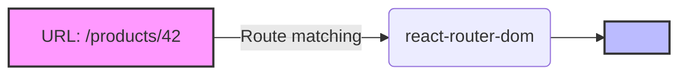
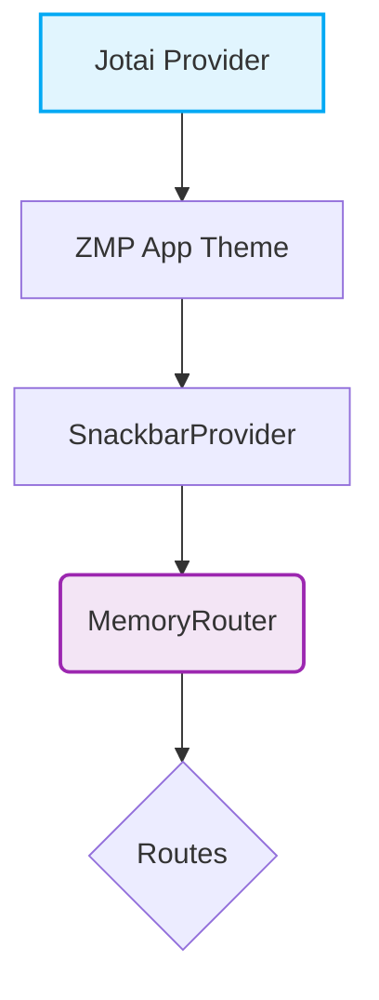

# :material-routes: React Router DOM — Định tuyến cho React App

!!! abstract "Thông tin bài học"
    - **Series**: React với TypeScript · **Bài số**: 1
    - **Độ khó**: Beginner :material-arrow-right: Intermediate
    - **Thời gian**: ~30 phút
    - **Stack**: React 18, TypeScript, Zalo Mini App (ZMP)

---

## 1. Router là gì và tại sao cần?

React là thư viện xây dựng **Single Page Application (SPA)**. Trong SPA, chỉ có **một file HTML duy nhất** được tải — mọi điều hướng xảy ra phía client, không reload trang.

**Vấn đề**: Làm sao React biết hiển thị component nào khi user truy cập `/products` hay `/cart`?

**Giải pháp**: `react-router-dom` — thư viện routing phổ biến nhất cho React, cho phép bạn:

- Ánh xạ URL :material-arrow-right: Component
- Điều hướng mà **không reload trang**
- Quản lý lịch sử trình duyệt (back/forward)
- Truyền dữ liệu qua URL params và query string



---

## 2. Các loại Router

`react-router-dom` cung cấp 3 loại router chính, mỗi loại phù hợp với môi trường khác nhau:

=== ":material-web: BrowserRouter"
    Sử dụng **HTML5 History API** (`pushState`). Phù hợp cho web app thông thường, có server hỗ trợ cấu hình fallback về `index.html`.
    ```text
    https://example.com/products/42
    ```

=== ":material-pound: HashRouter"
    Sử dụng **URL hash**. Phù hợp cho static hosting (như GitHub Pages cũ) khi không cấu hình được server.
    ```text
    https://example.com/#/products/42
    ```

=== ":material-memory: MemoryRouter"
    Lưu lịch sử trong **memory** (array nội bộ), URL trên thanh địa chỉ không thay đổi. Phù hợp cho testing, hoặc môi trường không có History API (Zalo Mini App, Electron).
    ```text
    (URL trình duyệt ẩn)
    ```

!!! warning "Lưu ý nền tảng: Zalo Mini App"
    Zalo WebView block HTML5 History API, do đó **bắt buộc dùng `MemoryRouter`** thay vì `BrowserRouter`.

---

## 3. Cài đặt

Sử dụng package manager yêu thích của bạn:

=== "npm"
    ```bash
    npm install react-router-dom
    ```
=== "yarn"
    ```bash
    yarn add react-router-dom
    ```
=== "pnpm"
    ```bash
    pnpm add react-router-dom
    ```

!!! tip "TypeScript Support"
    `react-router-dom` v6+ đã bao gồm sẵn TypeScript types — không cần cài `@types/react-router-dom` riêng.

---

## 4. Cấu hình cơ bản

Tách file constants cho route giúp ứng dụng có type-safety tốt hơn:

```typescript title="src/constants/routes.ts"
export const ROUTES = {
  HOME: '/',
  PRODUCTS: '/products',
  PRODUCT_DETAIL: '/products/:id',
  CART: '/cart',
  PROFILE: '/profile',
} as const;

// Type-safe route paths
export type AppRoute = typeof ROUTES[keyof typeof ROUTES];
```

Thiết lập Routing Container:

```tsx title="src/router/AppRouter.tsx" hl_lines="8-12"
import { Routes, Route, Navigate } from 'react-router-dom';
import { ROUTES } from '@/constants/routes';
import HomePage from '@/pages/home';
import ProductsPage from '@/pages/products';

export default function AppRouter() {
  return (
    <Routes>
      <Route path={ROUTES.HOME} element={<HomePage />} />
      <Route path={ROUTES.PRODUCTS} element={<ProductsPage />} />
      {/* Fallback 404: redirect về màn hình chính */}
      <Route path="*" element={<Navigate to={ROUTES.HOME} replace />} />
    </Routes>
  );
}
```

---

## 5. Các hook thiết yếu

### :material-cursor-pointer: `useNavigate` — Điều hướng programmatic

```tsx title="Điều hướng bên trong Component"
import { useNavigate } from 'react-router-dom';

function ProductCard({ id }: { id: number }) {
  const navigate = useNavigate();

  const handleClick = () => {
    // Điều hướng đến trang chi tiết
    navigate(`/products/${id}`);

    // Truyền thêm state
    // navigate('/checkout', { state: { productId: id } });

    // Thay thế (replace: không lưu vào lịch sử)
    // navigate('/home', { replace: true });
  };

  return <button onClick={handleClick}>Xem chi tiết</button>;
}
```

---

### :material-link-variant: `useParams` & `useSearchParams`

=== "useParams (Path params)"
    Lấy giá trị từ dynamic segment (ví dụ `:id`).
    ```tsx
    import { useParams } from 'react-router-dom';

    // Route: /products/:category/:id
    function ProductDetail() {
      const { category, id } = useParams<{ category: string; id: string }>();
      return <h1>Chuyên mục {category} - Sản phẩm #{id}</h1>;
    }
    ```

=== "useSearchParams (Query params)"
    Quản lý query string (`?key=value`).
    ```tsx
    import { useSearchParams } from 'react-router-dom';

    function ProductList() {
      const [searchParams, setSearchParams] = useSearchParams();
      const page = searchParams.get('page') ?? '1';

      const nextPage = () => setSearchParams({ page: String(Number(page) + 1) });

      return <button onClick={nextPage}>Trang sau</button>;
    }
    ```

---

## 6. Nested Routes & Layouts

Nested routes là pattern siêu mạnh mẽ: Component cha giữ layout cố định, Component con thay đổi dựa theo route.

```tsx title="Layout với Outlet" hl_lines="9"
import { Outlet } from 'react-router-dom';

function DashboardLayout() {
  return (
    <div className="layout-container">
      <Sidebar />
      <main className="content">
        {/* Nơi render sub-route */}
        <Outlet /> 
      </main>
    </div>
  );
}
```

```tsx title="Định nghĩa Nested Routes"
<Routes>
  <Route path="/dashboard" element={<DashboardLayout />}>
    <Route index element={<DashboardHome />} />       {/* /dashboard */}
    <Route path="orders" element={<Orders />} />       {/* /dashboard/orders */}
    <Route path="settings" element={<Settings />} />   {/* /dashboard/settings */}
  </Route>
</Routes>
```

---

## 7. Protected Routes (Chặn điều hướng)

Sử dụng Higher-Order Component hoặc Wrapper Component để bảo vệ route:

??? quote "Mã nguồn ProtectedRoute.tsx (Click để xem)"
    ```tsx
    import { Navigate, Outlet } from 'react-router-dom';
    import { useAuthStore } from '@/store/auth';

    export default function ProtectedRoute({ redirectTo = '/login' }) {
      const isAuthenticated = useAuthStore((s) => s.isAuthenticated);

      if (!isAuthenticated) {
        return <Navigate to={redirectTo} replace />;
      }
      return <Outlet />; // Cho phép đi tiếp
    }
    ```

    **Cách dùng:**
    ```tsx
    <Route element={<ProtectedRoute />}>
      <Route path="/dashboard" element={<Dashboard />} />
      <Route path="/profile" element={<Profile />} />
    </Route>
    ```

---

## 8. Tối ưu với Lazy Loading

Tải component **theo nhu cầu** giúp giảm dung lượng bundle ban đầu:

```tsx title="Lazy Loading Routes" hl_lines="1 5-7 12 18"
import { lazy, Suspense } from 'react';
import { BrowserRouter, Routes, Route } from 'react-router-dom';

// Tải khi được gọi
const HomePage = lazy(() => import('./pages/HomePage'));
const ProductsPage = lazy(() => import('./pages/ProductsPage'));
const CartPage = lazy(() => import('./pages/CartPage'));

function App() {
  return (
    <BrowserRouter>
      <Suspense fallback={<div className="spinner">Đang tải...</div>}>
        <Routes>
          <Route path="/" element={<HomePage />} />
          <Route path="/products" element={<ProductsPage />} />
          <Route path="/cart" element={<CartPage />} />
        </Routes>
      </Suspense>
    </BrowserRouter>
  );
}
```

---

## 9. :material-star-circle: Thực chiến: Zalo Mini App

Khác với Web thông thường, Zalo Mini App chạy trong WebView và chặn History API. Giải quyết bằng `MemoryRouter`.

### Thứ tự Providers (Rất quan trọng)

!!! danger "Jotai Provider phải nằm NGOÀI Router"
    Nếu đặt `<Provider>` (của Jotai/Redux) bên trong `<MemoryRouter>`, mỗi lần điều hướng app có thể unmount/remount dẫn đến **bị mất state toàn cục**.

**Cấu trúc chuẩn:**



```tsx title="src/components/layout.tsx"
import { MemoryRouter, Routes, Route, Navigate } from 'react-router-dom';
import { App, SnackbarProvider } from 'zmp-ui';
import HomePage from '@/pages';
import { ROUTES } from '@/constants/routes';

export default function Layout() {
  return (
    <App theme="light">
      <SnackbarProvider>
        {/* Khởi tạo entry đầu tiên là HOME */}
        <MemoryRouter initialEntries={[ROUTES.HOME]} initialIndex={0}>
          <Routes>
            <Route path={ROUTES.HOME} element={<HomePage />} />
            <Route path="*" element={<Navigate to={ROUTES.HOME} replace />} />
          </Routes>
        </MemoryRouter>
      </SnackbarProvider>
    </App>
  );
}
```

---

## :material-check-all: Tổng kết & Bài tập

!!! success "Những gì bạn đã học"
    - :material-router-network: **3 loại Router:** `BrowserRouter`, `HashRouter`, `MemoryRouter`
    - :material-hook: **Hooks mạnh mẽ:** `useNavigate`, `useParams`, `useLocation`
    - :material-layers: **Patterns quan trọng:** Nested Routes, Protected Routes, Lazy Loading
    - :material-cellphone-link: **Đặc tả Platform:** Cấu hình `MemoryRouter` cho Zalo Mini App

**Bài tập thực hành:**

- [x] Định nghĩa một `ROUTES` constant file sử dụng `as const`.
- [ ] Tạo thử một Nested Route (chia layout Dashboard / Sidebar).
- [ ] Chuyển file `layout.tsx` của bạn từ zmp-ui router sang `MemoryRouter`.
