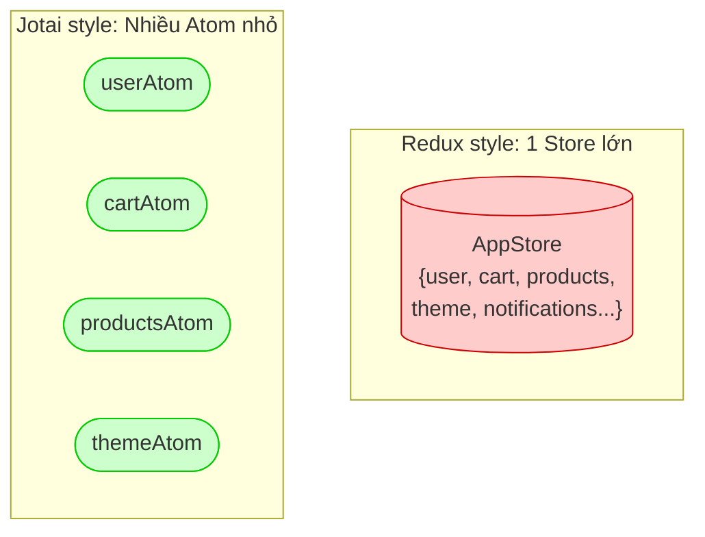
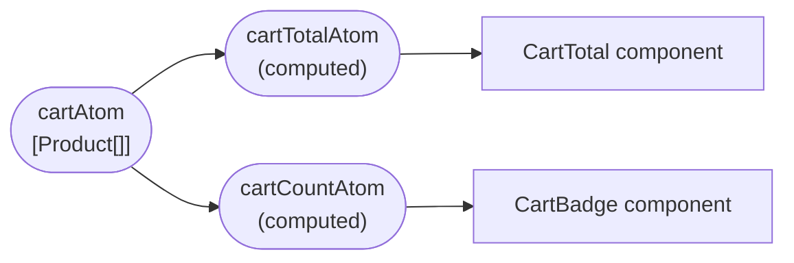

# :material-atom: Jotai — Quản lý State theo kiểu Nguyên Tử

!!! abstract "Thông tin bài học"
    - **Series**: React với TypeScript · **Bài số**: 2
    - **Độ khó**: Beginner :material-arrow-right: Intermediate
    - **Thời gian**: ~25 phút
    - **Stack**: React 18, TypeScript, Jotai v2, Zalo Mini App (ZMP)

---

## 1. Vấn đề của State Management truyền thống

Trước khi học Jotai, hãy nhìn vào vấn đề mà nó sinh ra để giải quyết.

### Prop Drilling — Khoan qua nhiều tầng component

Khi state cần chia sẻ giữa các component không liên quan trực tiếp, bạn phải truyền props qua từng tầng trung gian dù tầng đó không cần dùng.

```
App
├── Header            ← cần biết userInfo
├── ProductList
│   └── ProductCard
│       └── AddToCart ← cần biết cartCount
└── Footer            ← cần biết cartCount
```

Để `Header` và `Footer` biết `cartCount`, bạn phải truyền từ `App → ProductList → ProductCard → ...` — đây là **Prop Drilling**.

---

### Context API — Giải pháp nhưng kèm cạm bẫy

`React.Context` sinh ra để giải quyết prop drilling. Nhưng nó có **hạn chế lớn về hiệu năng**:

!!! warning "Vấn đề Re-render của Context"
    Mỗi khi **bất kỳ giá trị nào** trong Context thay đổi, **tất cả** component đang dùng `useContext()` đó đều bị re-render — kể cả component không cần giá trị đang thay đổi.

```typescript
// Context chứa toàn bộ state của app
const AppContext = createContext({
  user: null,       // Thay đổi khi login
  cart: [],         // Thay đổi khi thêm/bớt hàng
  theme: 'light',   // Thay đổi ít khi
});

// ⚠️ Component này chỉ cần 'theme'
// nhưng sẽ re-render mỗi khi 'cart' thay đổi!
function ThemeButton() {
  const { theme } = useContext(AppContext);
  return <button className={theme}>...</button>;
}
```

---

### Redux — Mạnh nhưng nặng

Redux giải quyết được vấn đề re-render, nhưng yêu cầu rất nhiều boilerplate:

=== "Redux (cũ)"
    ```typescript
    // actions.ts
    const ADD_TO_CART = 'ADD_TO_CART';
    export const addToCart = (item) => ({ type: ADD_TO_CART, payload: item });

    // reducer.ts
    export function cartReducer(state = [], action) {
      switch (action.type) {
        case ADD_TO_CART: return [...state, action.payload];
        default: return state;
      }
    }

    // store.ts — setup
    // selectors.ts — tạo selector
    // component — connect, mapStateToProps...
    ```

=== "Jotai (so sánh)"
    ```typescript
    // state.ts — Chỉ cần thế này!
    export const cartAtom = atom<Product[]>([]);

    // Component
    const [cart, setCart] = useAtom(cartAtom);
    ```

> Redux phù hợp cho enterprise app lớn với team lớn. Với Mini App, đây là **overkill**.

---

## 2. Atomic State — Triết lý cốt lõi của Jotai

**"Atomic"** không phải thuật ngữ vật lý mà là cách tổ chức state:

> **Thay vì** lưu toàn bộ state trong một "store" lớn, hãy chia nhỏ thành các **atom** — đơn vị state nhỏ nhất, độc lập, có thể kết hợp với nhau.



**Kết quả**: Component chỉ subscribe vào **atom nó cần** → chỉ re-render khi atom đó thay đổi.

---

## 3. Jotai hoạt động như thế nào?

### 3.1 `atom()` — Tạo đơn vị state

```typescript
import { atom } from 'jotai';

// Atom đơn giản với giá trị ban đầu
const countAtom = atom(0);
const nameAtom = atom('');
const cartAtom = atom<Product[]>([]);

// Atom async — Jotai hỗ trợ Promise out of the box!
const productsAtom = atom<Promise<Product[]>>(fetchProducts());
```

---

### 3.2 `useAtom()` — Đọc và ghi

```typescript
import { useAtom, useAtomValue, useSetAtom } from 'jotai';

function CartButton() {
  // Cả đọc lẫn ghi
  const [cart, setCart] = useAtom(cartAtom);

  // Chỉ đọc (không trigger re-render khi set)
  const cart = useAtomValue(cartAtom);

  // Chỉ ghi (component không re-render khi atom thay đổi)
  const setCart = useSetAtom(cartAtom);

  return <button>{cart.length} sản phẩm</button>;
}
```

!!! tip "Tối ưu hiệu năng"
    - Dùng `useAtomValue` khi component **chỉ hiển thị** data → tránh re-render thừa khi set
    - Dùng `useSetAtom` cho nút bấm chỉ trigger action → component không re-render khi data thay đổi

---

### 3.3 Derived Atom — Tính toán từ atom khác

```typescript
const cartAtom = atom<Product[]>([]);

// Derived atom: tự tính toán từ cartAtom
const cartTotalAtom = atom(
  (get) => get(cartAtom).reduce((sum, p) => sum + p.price, 0)
);

const cartCountAtom = atom(
  (get) => get(cartAtom).length
);
```



Khi `cartAtom` thay đổi, chỉ những component subscribe vào `cartTotalAtom` hoặc `cartCountAtom` mới re-render.

---

## 4. So sánh với các giải pháp khác

| Tiêu chí | Context API | Redux Toolkit | Zustand | **Jotai** |
|----------|:-----------:|:-------------:|:-------:|:---------:|
| Bundle size | ~0KB | ~45KB | ~8KB | ~8KB |
| Boilerplate | Thấp | Cao | Thấp | **Cực thấp** |
| Re-render tối ưu | Kém | Tốt | Tốt | **Tốt** |
| Async state | Phức tạp | Phức tạp | Middleware | **Tích hợp sẵn** |
| TypeScript | Tốt | Tốt | Tốt | **Xuất sắc** |
| Suspense | Không | Không | Không | **Có** |
| Learning curve | Thấp | Cao | Thấp | **Thấp** |
| Dev Tools | Không | Có | Có | Có |

---

## 5. Khi nào nên (và không nên) dùng Jotai

=== ":material-check-circle: Nên dùng"
    - App **vừa và nhỏ** cần shared state đơn giản
    - Khi cần xử lý **async state** (API calls) mà không muốn setup middleware phức tạp
    - Khi muốn **React Suspense** tích hợp tự nhiên
    - Team nhỏ, cần onboard nhanh
    - **Zalo Mini App** — bundle size nhỏ, no History API concerns

=== ":material-close-circle: Không nên dùng"
    - App enterprise cần **time-travel debugging** mạnh mẽ → Redux
    - Cần **middleware ecosystem** đầy đủ → Redux Toolkit + RTK Query
    - Team đã quen và **thành thạo Zustand** → giữ luôn
    - State phức tạp với nhiều **computed selector lồng nhau** → Recoil có thể phù hợp hơn

---

## 6. Thực chiến: Jotai trong Zalo Mini App

Dưới đây là cấu trúc `state.ts` của project **pretty-little-shop-vn** — một Zalo Mini App thực tế. Các patterns dưới đây bạn sẽ sử dụng thường xuyên.

### Pattern 1: Atom cơ bản với async data

```typescript title="src/state.ts — Listing atoms"
import { atom } from 'jotai';
import type { Service, Doctor } from './types';

// Atom chứa Promise → tương thích Suspense tự nhiên
export const servicesState = atom<Promise<Service[]>>(fetchServices());
export const doctorsState = atom<Promise<Doctor[]>>(fetchDoctors());
```

> **Tại sao dùng `atom<Promise<T>>`?** Jotai + React Suspense hiểu khi atom trả về Promise, component sẽ tự suspend cho đến khi data ready — không cần `isLoading` state thủ công.

---

### Pattern 2: `atomFamily` — Atom theo tham số

```typescript title="src/state.ts — Detail atoms"
import { atomFamily } from 'jotai/utils';

// Tạo atom riêng cho từng ID
// atomFamily caches kết quả → gọi serviceByIdState(1) nhiều lần = chỉ 1 atom
export const serviceByIdState = atomFamily((id: number) =>
  atom(async (get) => {
    const services = await get(servicesState);
    return services.find((s) => s.id === id);
  })
);

// Dùng trong component
function ServiceDetail({ id }: { id: number }) {
  const service = useAtomValue(serviceByIdState(id));
  return <h1>{service?.name}</h1>;
}
```

---

### Pattern 3: `atomWithReset` — Form state có thể reset

```typescript title="src/state.ts — Form atoms"
import { atomWithReset } from 'jotai/utils';
import { useResetAtom } from 'jotai/utils';

export const bookingFormState = atomWithReset<BookingForm>({
  symptoms: [],
  description: '',
  images: [],
});

// Reset về giá trị ban đầu sau khi submit
function BookingForm() {
  const resetForm = useResetAtom(bookingFormState);

  const handleSubmit = async () => {
    await submitBooking();
    resetForm(); // ← Sạch form, không cần setForm({symptoms:[], ...})
  };
}
```

---

### Pattern 4: `atomWithRefresh` — Fetch lại data theo yêu cầu

```typescript title="src/state.ts — Refreshable atom"
import { atomWithRefresh } from 'jotai/utils';
import { getUserInfo } from 'zmp-sdk';

// Atom có thể trigger refetch từ bên ngoài
export const userState = atomWithRefresh(() =>
  getUserInfo({ avatarType: 'normal' })
    .catch(() => { throw new Error('Vui lòng cho phép truy cập!'); })
);

// Dùng trong component
function UserProfile() {
  const [user, refreshUser] = useAtom(userState);

  return (
    <div>
      
      <button onClick={refreshUser}>Làm mới</button>
    </div>
  );
}
```

---

### Pattern 5: `loadable` — Xử lý loading/error không dùng Suspense

```typescript title="src/state.ts — Loadable pattern"
import { loadable } from 'jotai/utils';

// Wrap async atom vào loadable → không cần Suspense boundary
export const searchResultState = atomFamily((keyword: string) =>
  loadable(
    atom(async (get) => {
      const doctors = await get(doctorsState);
      return doctors.filter(d => d.name.includes(keyword));
    })
  )
);

// Trong component
function SearchResult({ keyword }: { keyword: string }) {
  const result = useAtomValue(searchResultState(keyword));

  if (result.state === 'loading') return <Spinner />;
  if (result.state === 'hasError') return <ErrorMessage />;
  return <List data={result.data} />;
}
```

---

### Provider Setup cho Zalo Mini App

```typescript title="src/app.ts — Entry point"
import { createRoot } from 'react-dom/client';
import { Provider } from 'jotai';
import Layout from './components/layout';

createRoot(document.getElementById('app')!).render(
  // Provider phải ở NGOÀI MemoryRouter
  // để state không bị reset khi navigate
  <Provider>
    <Layout />
  </Provider>
);
```

---

## :material-check-all: Tổng kết

!!! success "Những gì bạn đã học"
    - :material-atom: **Atomic thinking**: Chia nhỏ state thành atom độc lập thay vì 1 store lớn
    - :material-lightning-bolt: **Hiệu năng**: Chỉ re-render component dùng atom đang thay đổi
    - :material-hook: **Hooks**: `useAtom`, `useAtomValue`, `useSetAtom` — chọn đúng để tối ưu
    - :material-infinity: **Async native**: `atom<Promise<T>>` + Suspense không cần middleware
    - :material-package-variant: **Utils mạnh**: `atomFamily`, `atomWithReset`, `atomWithRefresh`, `loadable`

**Quick Reference:**

| Muốn làm gì | Dùng cái gì |
|-------------|-------------|
| State đơn giản | `atom(value)` |
| Tính toán từ atom khác | `atom((get) => ...)` |
| Atom theo ID/param | `atomFamily((param) => atom(...))` |
| Form có thể reset | `atomWithReset(initialValue)` |
| Fetch lại theo yêu cầu | `atomWithRefresh(fn)` |
| Loading/error manual | `loadable(asyncAtom)` |
| Đọc + ghi | `useAtom(atom)` |
| Chỉ đọc | `useAtomValue(atom)` |
| Chỉ ghi | `useSetAtom(atom)` |

---

**Bài tập thực hành:**

- [ ] Tạo một `cartAtom` đơn giản và hiển thị số lượng trong Navbar
- [ ] Tạo `cartTotalAtom` là derived atom tính tổng giá trị giỏ hàng
- [ ] Dùng `atomWithReset` cho một form đặt hàng, reset sau khi submit thành công
- [ ] Thử `loadable` để hiển thị skeleton loading mà không cần Suspense
